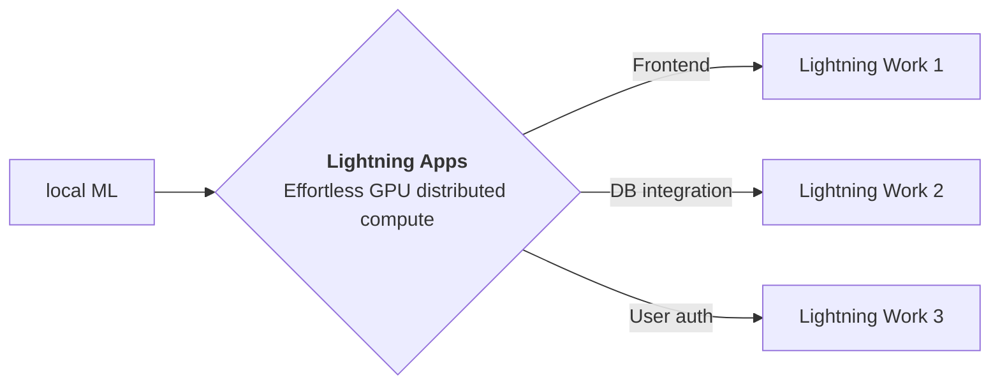

<div style="height: 90pt;"></div>
<div style="flex: 0 0 16%; margin-top: -10pt;">

</div>
<div style="flex: 0 0 65%; text-align: center;">
<h1 style="margin-bottom: 10pt;">SpiderMan Universe Finder</h1>
<h2>Recognize the SpiderMan actor name powered by FaceNet paper.</h2>
</div>
<div style="flex: 1">
    <div style="display: flex; align-items: center;">
        
        <div style="font-size: 0.9rem; margin-right: 5pt;"><a href="https://github.com/Lightning-AI/">lightning</a></div>
    </div>
    <div style="display: flex; align-items: center;">
        
        <div style="font-size: 0.9rem;"><a href="https://twitter.com/PyTorchLightnin">@PyTorchLightnin</a></div>
    </div>
</div>

--split--

# SpiderMan Universe Finder based on FaceNet (A Unified Embedding for Face Recognition and Clustering)

This app is a research poster demo of FaceNet paper. It showcases paper, a notebook, a blog, and a model demo where you
can upload photos of Peter Parker (SpiderMan) from any universe and show you their bio.
To create a research poster for your work please
use [Lightning Research Template app](https://github.com/Lightning-AI/LAI-research-template-App).


## FaceNet achieved a record new `99.63%` accuracy on the widely used Labeled Faces in the Wild (LFW) dataset.

You can fork this app and edit to customize according to your need.

Thanks to [timesler](https://github.com/timesler) for building amazing
library [facenet-pytorch](https://github.com/timesler/facenet-pytorch).

[//]: # ()

FaceNet uses a deep convolutional network trained to directly optimize the embedding itself, rather than an intermediate
bottleneck layer as in previous deep learning approaches. To train, it uses triplets of roughly aligned matching /
non-matching face patches generated using a novel online triplet mining method. The benefit of this approach is much
greater representational efficiency.

--split--

# Lightning Apps

## Lightning Apps can be built for any AI use case, including AI research, fault-tolerant production-ready pipelines, and everything in between.

!!! abstract "Key Features"

    - **Easy to use-** Lightning apps follow the Lightning philosophy- easy to read, modular, intuitive, pythonic and highly composable interface that allows you to focus on what's important for you, and automate the rest.
    - **Easy to scale**- Lightning provides a common experience locally and in the cloud. The Lightning.ai cloud platform abstracts the infrastructure, so you can run your apps at any scale. The modular and composable framework allows for simpler testing and debugging.
    - **Leverage the power of the community-** Lightning.ai offers a variety of apps for any use case you can use as is or build upon. By following the best MLOps practices provided through the apps and documentation you can deploy state-of-the-art ML applications in days, not months.



### Available at : `Lightning-AI/lightning-template-research-app/app.py`

```python
import lightning as L

poster_dir = "resources"
paper = "https://arxiv.org/pdf/1503.03832"
blog = "https://aniketmaurya.com/tensorflow/face%20recognition/2019/01/07/face-recognition.html"
github = "https://github.com/timesler/facenet-pytorch"

app = L.LightningApp(
    ResearchApp(
        poster_dir=poster_dir,
        paper=paper,
        blog=blog,
        github=github,
        notebook_path="resources/facenet-pytorch.ipynb",
        launch_jupyter_lab=False,  # don't launch for public app, can expose to security vulnerability
        launch_gradio=True,
    )
)
```

### Citation

```bibtex

@article{YourName,
  title={Your Title},
  author={Your team},
  journal={Location},
  year={Year}
}

```
